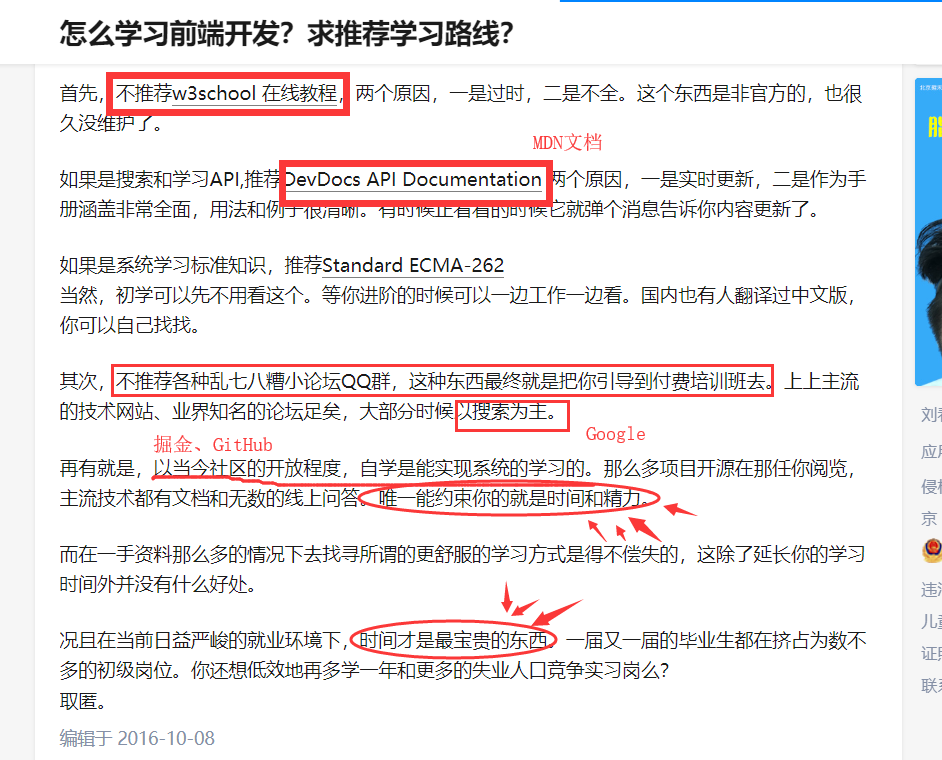

# 如何学习前端

借用来自[知乎的回答](https://www.zhihu.com/question/30180100)：

## 阶段规划

### 一、基础入门

> 学会 HTML/CSS/JavaScript 基本语法，能快速对页面进行布局，完成静态页面编写，实现表单验证Ajax请求发送。理解前端是什么，前端在软件开发中的地位。学会使用 Git 版本管理。

大概**一个月**时间：2019.10.16 - 2019.11.16 

#### 1) HTML/CSS 进度 `0%`

- **时间**：一个星期。:ok:不？？

> **关键字**：盒子模型、常用标签、块级标签和内联标签、布局（float/position）、样式权重、IE模型和标准模型、结构与样式分离、响应式开发...
>
> **资料**：慕课网视频资料为主（不要看书不要看书不要看书）。从上到下，循序渐进。会的就跳过，最快速度学完。
>
> - [初识HTML+CSS](https://www.imooc.com/learn/9) 
> - [如何用CSS进行网页布局](https://www.imooc.com/learn/57) 
> - [企业网站综合布局实战](https://www.imooc.com/learn/147) 
> - [手把手教你实现电商网站开发](https://www.imooc.com/learn/100) 
> - :star:[网页简单布局之结构与表现原则](https://www.imooc.com/learn/20) 
>
> **成果**：模仿一个静态网站（如：[今日头条](https://www.toutiao.com/)），最大程度还原。

---

#### 2) JavaScript 进度 `0%`

- **时间**：不超过一个月。加油啊，没问题的。:muscle::muscle::muscle: 

> **关键字**：数据类型、条件语句、判断语句、循环语句等等等基本语法；
>
> **资料**：慕课网视频、[MDN文档](https://developer.mozilla.org/zh-CN/)、[现代JavaScript教程](https://zh.javascript.info/)
>
> - [JavaScript入门篇](https://www.imooc.com/learn/36) 
> - [JavaScript进阶篇](https://www.imooc.com/learn/10) 
> - [JavaScript深入浅出](https://www.imooc.com/learn/277) 
> - [Ajax全接触](https://www.imooc.com/learn/250) 
>
> **成果**：继续完善今日头条静态页面，添加交互、表单提交、弹窗等。
>
> **其它**：从这里开始，以后**每天**（学习日）用 JavaScript 做一道编程算法题:pencil:，简单难度的。刷题地址：[LeetCode-cn](https://leetcode-cn.com/problemset/all/) 熟练之后，控制每道题做题时间为 30 分钟以内，练习算法逻辑思维与实际编码能力。

---

#### 3) jQuery / Bootstrap :no_bell:可忽略

> 学习使用 jQuery / Bootstrap 。了解一下，说实话我不会，没必要学习。之后可以学习一下 jQuery 的源码与设计思想。
>
> **成果**：使用 Bootstrap 编写响应式页面，用 jQuery 代替原生的 JavaScript 代码，继续编写今日头条页面。

---

#### 4) 其它

> **Git**：[【小马技术】Git入门-源代码版本管理工具](https://www.bilibili.com/video/av23380399) 
>
> 把今日头条项目更新到 GitHub 上，每天提交代码上去，写好详细的提交信息和介绍文档（MarkDown 格式）。
>
> 熟悉 Git 分支，在项目中使用。使用 Git 对今日头条项目进行版本更新迭代，模拟团队协作。
>
> **社区**：每天必看 [掘金社区](https://juejin.im/) 打开手机就想刷微博、刷空间朋友圈一样，打开电脑就想访问 [掘金](https://juejin.im/)。
>
> **科学上网**：学会科学上网，使用 Google 寻找你想要的世界。（完全抛弃 Baidu）
>
> **爱上写代码**：获得成就感，相信代码改变世界。（实际上已经改变了）
>
> **每天总结**：让我看到你学了什么，遇到什么问题了，节约时间少走弯路咯。（模板参考 [2019-10.md](./2019-10.md)）

---

#### 5) 最后

> 再再再自己找一个喜欢的网站，模仿出来，尽可能还原。同时代码每天更新到 GitHub 上面。

---

### 二、前端工程化学习

两个月时间。平均每天6小时的话。

React/Vue  Webpack 小程序开发

### 三、前端基础系统深入

形成自己的知识体系，系统复习基础知识。

这个阶段推荐阅读书籍，查看文档。

:star:《JavaScript 高级程序设计》读完三遍就可以去面试了

《ES6 标准入门》

《CSS 世界》

刷题 LeetCode 中等难度，熟悉堆栈、链表、树、图等数据结构，排序算法、搜索等。

[初级算法](https://leetcode-cn.com/explore/featured/card/top-interview-questions-easy/) 

一个帖子：[史上最全的前端实习面试攻略，欢迎补充(求置顶)~~~~](https://www.nowcoder.com/discuss/84088?type=2&order=0&pos=3&page=1) 
